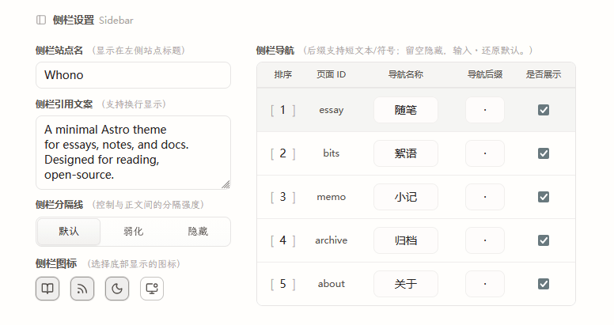

astro-whono provides a local Theme Console for centrally managing theme-level configuration in the development environment.

Theme Console lives at `/admin/theme/`. It mainly covers site info, sidebar, homepage, and inner-page copy, plus some reading and code-display options, making it easy to quickly adjust the site's theme settings after a fork or clone.

:::note[Development environment]
`/admin/theme/` is only operable in the development environment. In production, visiting shows only a local-development notice, with no write access.
:::

## Local Startup and Entry

During local development, start the project with:

```bash
npm install
npm run dev
```

By default, the dev server runs on `http://localhost:4321/`. Once it's running, you can go directly to:

```text
http://localhost:4321/admin/theme/
```

If you've changed the local dev port, replace `4321` with your actual port.

`/admin/` is the dashboard's Site Overview entry, used to view a snapshot of the site. Theme Console lives at `/admin/theme/` — be sure to tell the two entries apart when using them.

## Development vs. Production

Theme Console is a configuration tool aimed at local maintainers; here's how it behaves in different environments:

- Development: `/admin/theme/` can read and save theme configuration
- Production: `/admin/theme/` shows only a local-development notice, with no writable form displayed
- `/api/admin/settings/`: only available in development, not usable as a public API

## Scope

Theme Console currently handles the following kinds of configuration:

- Site title, default language, default SEO description
- Site icons (browser tab / touch icon)
- Footer year and copyright text
- The `/admin/` Overview public-visibility toggle and its hidden-state message
- Social links and their order
- Sidebar site name, quote text, nav order, and visibility
- Sidebar action icons (reading mode / RSS / theme toggle / site overview entry)
- Homepage hero, homepage intro copy, and homepage internal links
- Titles and subtitles for `/essay/`, `/archive/`, `/bits/`, `/memo/`, `/about/`
- Article metadata display options
- Code block line numbers
- Typography fonts for the four roles: body / copy / monospace / brand


## Config Files

Saved settings are automatically written to `src/data/settings/`, grouped by category:

```text
src/data/settings/
  site.json
  shell.json
  home.json
  page.json
  ui.json
```

> If `src/data/settings/*.json` doesn't exist yet, it's generated automatically the first time you save in `/admin/theme/`.

Theme Console manages theme configuration within the repo, so related changes can still be tracked and rolled back through Git.

Theme configuration is always read in this fixed order: `src/data/settings/*.json` first, then legacy configuration, and finally the project defaults. The legacy configuration here mainly comes from `site.config.mjs` and default constants baked into components.<br>
In other words, right after cloning the project you can just use the defaults; as soon as you save once in Theme Console, a trackable settings JSON is generated.

## Page Groups

`/admin/theme/` is currently split into five groups by editing scenario.

### Site

`Site` handles site-level basic info:

- Site title
- Default language
- Default SEO description
- Footer year and copyright text
- Whether `/admin/` Overview is publicly visible, and the text shown when it's off
- Site icons (browser tab / touch icon)
- Social links

Site icons support uploading a square PNG (16–512px, under 256KB), corresponding to the browser tab icon and the mobile touch icon respectively; files are written to `public/images/site/` named by content hash, so replacing them isn't affected by the browser's icon cache. Once you customize the tab icon, the theme's default SVG/PNG icons are no longer emitted; the touch icon falls back independently and keeps the theme default if not customized. If an icon file is missing, the site automatically falls back to the theme's default icon without affecting the build. SVG icon upload isn't supported yet — you can replace `public/favicon.svg` directly (a manually maintained fixed path with no cache-busting, so the browser may still show the old icon after replacing the content).

> 

### Sidebar

`Sidebar` handles shell- and navigation-related configuration:

- Sidebar site name
- Sidebar quote text
- Sidebar divider style
- Sidebar action icon visibility (reading mode / RSS / theme toggle / site overview)
- Nav labels, order, suffix character, and visibility

> 

### Home

`Home` handles homepage display configuration:

- Hero image address and alt text
- Hero visibility
- Homepage intro main copy
- Homepage intro supplementary copy
- The primary and secondary links within the supplementary intro copy

> 

The homepage's supplementary intro still uses a fixed sentence structure — the dashboard only exposes the copy and link-target choices, keeping the homepage structure stable. Currently available targets include `archive`, `essay`, `bits`, `memo`, `about`, and `tag`.


### Inner Pages

`Inner Pages` handles unified copy and display strategy across inner pages:

- `/essay/` page title and subtitle
- `/archive/` page title and subtitle
- `/bits/` page title and subtitle
- `/memo/` page title and subtitle
- `/about/` page title and subtitle
- Whether article metadata shows date, tags, word count, and reading time
- `/bits/` default author name and avatar

> 


### Code

- Whether to show line numbers in code blocks

### Typography

`Typography` handles selecting fonts for four typography roles:

- Body font (article body and headings)
- Copy font (intro text, the About page, and similar contexts)
- Monospace font (code blocks and inline code)
- Brand font (sidebar site name and quote)

Once saved, it's written to `src/data/settings/ui.json` and takes effect on the next build. See the "Typography Fonts" section below for font sources, size, and how to add custom fonts.


## Typography Fonts

Each of the four font roles is chosen from its own set of font cards: each card renders a live preview in that font and shows a source badge; once selected, the full name and size details appear below the card so you can weigh the trade-offs. Built-in options fall into three source categories:

- **System fonts**: use fonts already present on the visitor's device, with no download.
- **Self-hosted fonts**: font files are shipped together with the site's build output — visitors never go through an external CDN, and the page makes no third-party requests.
- **Fetched-online fonts**: downloaded from an open-source font library (fontsource / Google Fonts) at build time and then self-hosted — the page still makes zero third-party requests, but the build machine needs access to the corresponding font source.

A single weight of a CJK font is typically over 1 MB, while system fonts involve zero download — weigh appearance against size accordingly.

### Adding Fonts Beyond the Card List

The card options come from the font registry `src/lib/fonts/registry.ts`. To add a font that isn't in the list, append a config block for it to the end of `THEME_FONT_REGISTRY` — the selection card, validation, and page styles all pick it up automatically, with no other files to change.

To keep builds reproducible and pages free of third-party requests, the registry only accepts pre-registered fonts — the UI doesn't support typing in an arbitrary font name. Each font picks one form based on how it's sourced; see the in-file comments for what each field means:

| Source | Use case | Key fields |
|---|---|---|
| `system` | System font stack | `fallbacks`; no download |
| `astro-fonts-api` | Open-source online fonts | `provider` (`fontsource` tends to have better reachability in mainland China / `google` needs access to fonts.google.com), `familyName`; CJK fonts must declare `subsets` (e.g. `['chinese-simplified', 'latin']`), otherwise CJK glyphs won't be bundled |
| `astro-fonts-api` + `provider: 'local'` | Offline or no-internet builds | Place font files in `src/assets/fonts/` and fill in `localVariants` — the build doesn't depend on the network |
| `subset-pipeline` | Needs CJK subsetting/compression | Also requires a source font, `scripts/font-subset.mjs`, and matching `global.css` entries — follow the existing default fonts as a reference |

If a fetched-online font fails to download during the build, the page automatically falls back to a system font and the build doesn't break; running `SITE_URL=... npm run check:prod-artifacts` reports this kind of silent fallback as an explicit error. After switching to one of these fonts in dev mode, you'll need to restart the dev server to see the effect.


## Save Mechanism

- Saves write back grouped by `site / shell / home / page / ui`, never modifying template source code directly
- Most fields offer a live preview or a clear mapping to a page
- Field validation runs before saving
- Saves include version info to prevent silent overwrites from concurrent edits
- The write process rolls back on failure, avoiding a half-succeeded state across multiple files

---

That covers Theme Console's current common configuration entry points and save mechanism. If you run into configuration issues or saving problems while using it, feel free to open an Issue.
